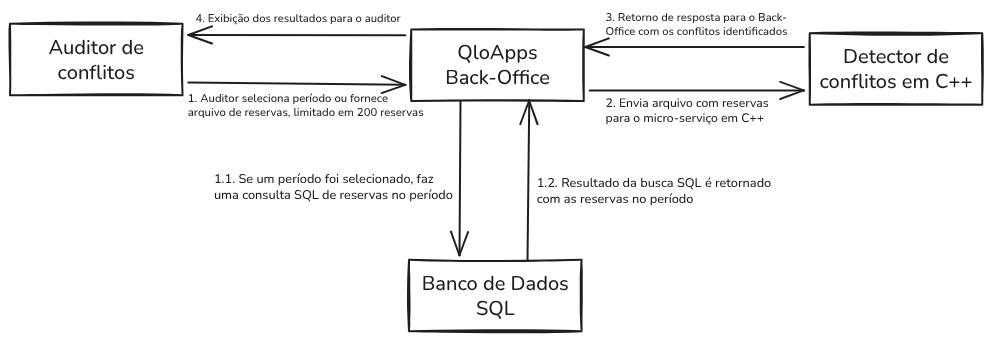
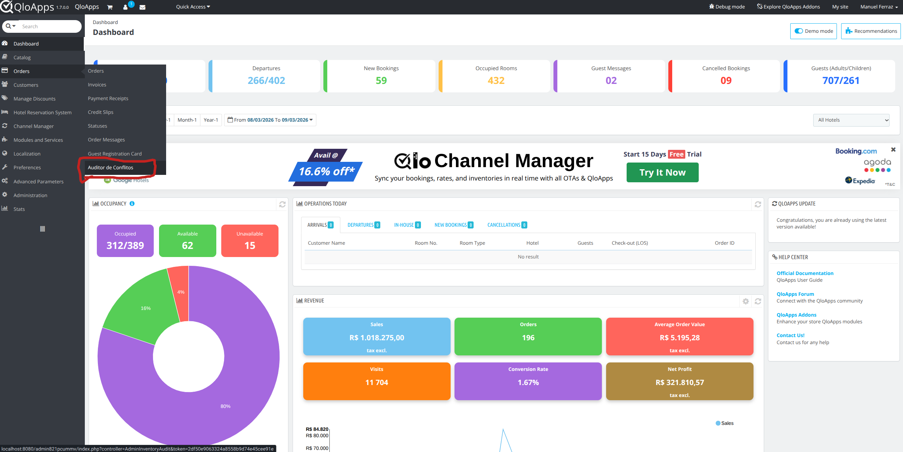
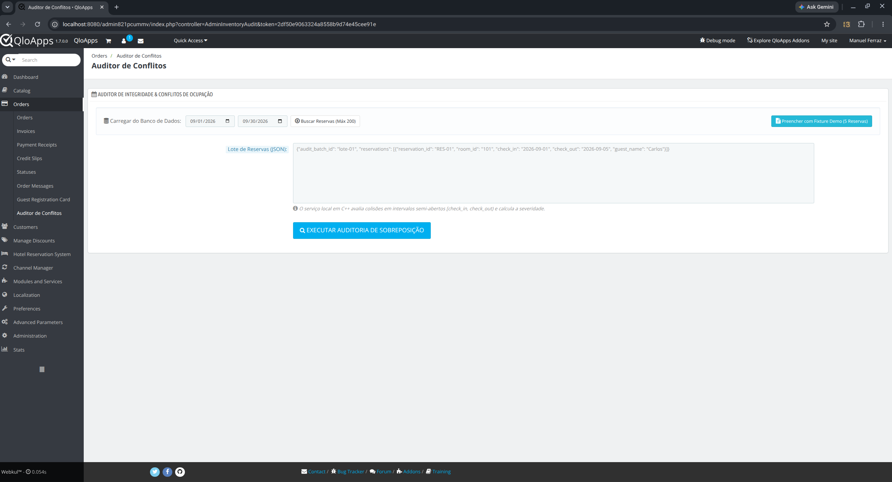
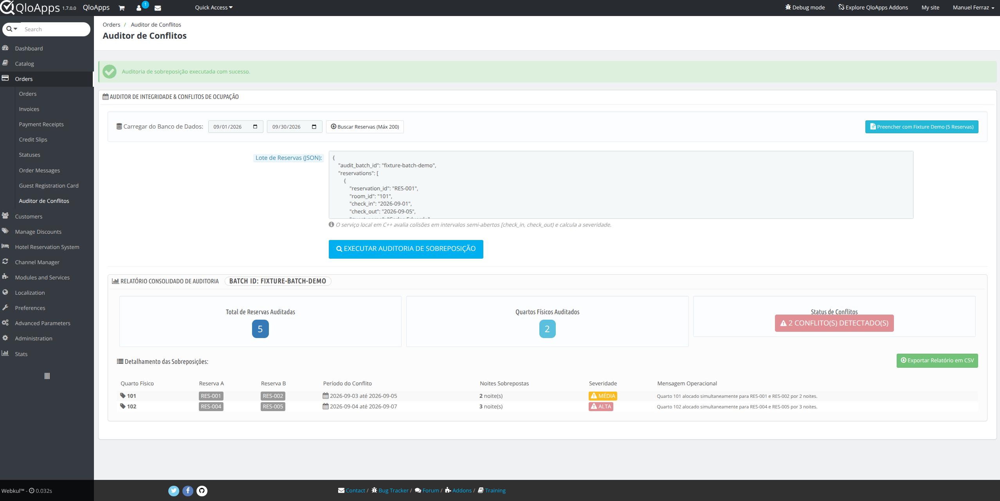
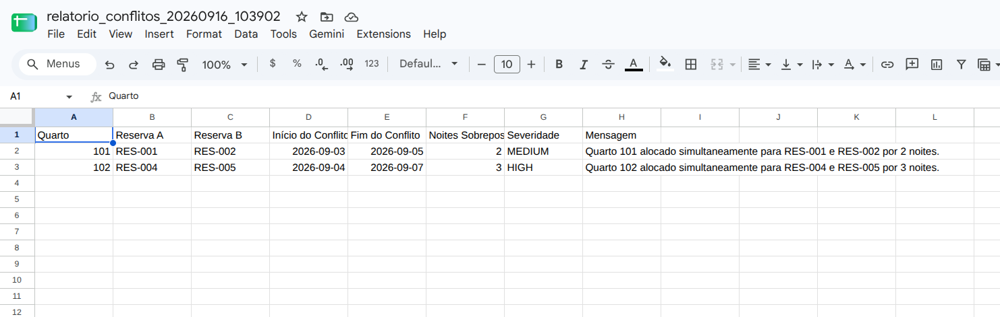
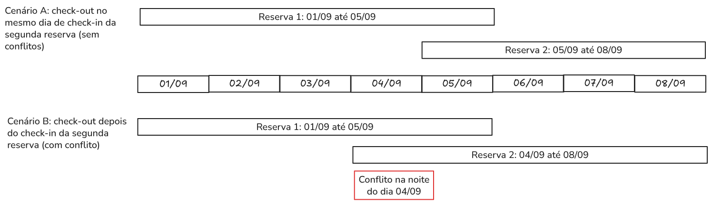
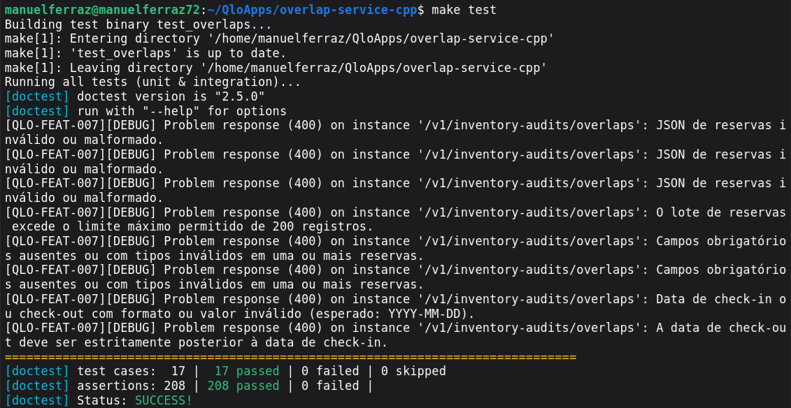
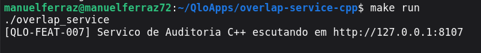

# Documentação Técnica e Operacional — Auditoria de Sobreposição de Inventário (RFC-007 / QLO-FEAT-007)

Esta documentação detalha todas as partes implementadas e modificadas para a funcionalidade de **Auditoria de Integridade de Alocações e Detecção de Sobreposição de Inventário** (`QLO-FEAT-007`). O sistema é composto por uma arquitetura híbrida de alta performance dividida entre o módulo administrativo para o **QloApps** (PHP/Smarty) e um **Microserviço local em C++** para cálculo ultrarrápido de sobreposição de intervalos.

---

## 1. Visão Geral e Contexto de Negócio

Em operações hoteleiras com grande volume de reservas oriundas simultaneamente de balcão (walk-in), motor de reservas direto e múltiplos canais de distribuição (OTAs via Channel Manager), é crítico prevenir falhas de concorrência ou alocações manuais que designem duas reservas ativas para o mesmo quarto físico na mesma data. Essa anomalia acarreta **dupla ocupação física (overbooking em nível de quarto)**, gerando custos de realocação e atritos operacionais no check-in.

O **Auditor de Sobreposição de Inventário** realiza varreduras determinísticas em lotes de até 200 reservas, aplicando rigorosamente a convenção hoteleira de intervalos semi-abertos `[check_in, check_out)`: a data de saída de uma reserva coincide com a data de entrada da reserva subsequente sem gerar colisão. Quando há sobreposição real, o motor calcula o número de noites conflitantes e classifica o incidente por nível de severidade (`HIGH` ou `MEDIUM`).

O objetivo desta auditoria é facilitar a identificação desses conflitos de reservas de quartos para que administradores do hotel resolvam o problema, seja cancelando alguma das reservas, propondo outro quarto disponível ou alguma outra solução possível, visando evitar problemas no momento do check-in.


Na imagem abaixo, podemos ver um resumo do fluxo de execução do programa, excluindo casos de erro.
<!-- [IMAGEM 1: Visão geral da arquitetura de integração entre o QloApps Back-Office e o Microserviço C++] -->

---

## 2. Arquitetura da Solução e Fluxo Ponta a Ponta

A solução adota uma topologia híbrida e desacoplada:
1. **Camada de Apresentação e Dados (QloApps Back-Office / PHP 8.1+ / Smarty 3.x):**
   - Integrada ao menu administrativo do QloApps na aba `Auditor de Conflitos`.
   - Permite consultar reservas ativas diretamente do banco MySQL por período ou injetar fixtures JSON.
   - Envia o lote validado via HTTP síncrono em loopback com timeout defensivo de 800 ms.
   - Renderiza métricas, badges visuais e tabela analítica de conflitos.
   - Permite exportação direta em CSV sanitizado contra injeção de fórmulas.
2. **Camada de Processamento de Alta Performance (Microserviço C++17 / cpp-httplib):**
   - Escuta na porta local `http://127.0.0.1:8107`.
   - Valida datas civis gregorianas e coerência temporal (`check_in < check_out`).
   - Agrupa reservas por quarto físico (`room_id`) e executa ordenação ($O(n \log n)$) cronológica com algoritmo de varredura para identificar conflitos.
   - Retorna respostas no formato RFC 7807 (`application/problem+json`) em casos de erro e JSON estruturado em caso de sucesso.

### Diagrama de Comunicação e Fluxo de Dados

```text
+-------------------------------------------------------------------------------+
|                             Navegador do Usuário                              |
|           (Auditor Noturno, Gerente de Operações ou Recepção)                 |
+---------------------------------------+---------------------------------------+
                                        |
                   1. Seleciona período ou carrega Fixture Demo
                                        v
+-------------------------------------------------------------------------------+
|                Módulo QloApps: [qloinventoryaudit] (PHP)                      |
|                                                                               |
|  * Controller: [AdminInventoryAuditController.php]                           |
|  * Template:   [audit_dashboard.tpl]                                         |
|                                                                               |
|  - Consulta MySQL (`ps_htl_booking_detail` e `ps_customer`)                   |
|  - Valida teto da RN-005 (<= 200 reservas) para evitar falsos negativos       |
|  - Despacha HTTP POST com cabeçalho X-Correlation-ID                          |
+---------------------------------------+---------------------------------------+
                                        |
               2. HTTP POST síncrono (Loopback: http://127.0.0.1:8107)
                  Timeout: 800ms | Connect: 600ms
                                        v
+-------------------------------------------------------------------------------+
|               Microserviço C++: [overlap-service-cpp]                         |
|                                                                               |
|  * Ponto de Entrada: [main.cpp] e [Server.cpp] (cpp-httplib)                 |
|  * Motor de Auditoria: [OverlapDetector.cpp]                                 |
|                                                                               |
|  - Validação estrita de datas civis ISO 8601 YYYY-MM-DD                      |
|  - Agrupamento em buckets por room_id                                         |
|  - Ordenação cronológica O(n log n) e varredura de intervalos semi-abertos    |
|  - Cálculo de noites sobrepostas e severidade (HIGH / MEDIUM)                 |
+---------------------------------------+---------------------------------------+
                                        |
               3. Resposta JSON 200 OK (ou RFC 7807 Problem Details 400)
                                        v
+-------------------------------------------------------------------------------+
|                 Renderização e Ações no Back-Office                           |
|                                                                               |
|  - Alertas visuais com badges de severidade ALTA / MÉDIA                      |
|  - Tabela detalhada de sobreposições por quarto físico                        |
|  - Exportação em CSV com sanitização contra CSV Injection (CWE-1236)          |
+-------------------------------------------------------------------------------+
```

---

## 3. Módulo PHP para QloApps (`modules/qloinventoryaudit`)

O módulo está localizado em `modules/qloinventoryaudit`.

### 3.1. Arquivo de Registro do Módulo: `qloinventoryaudit.php`

Responsável por registrar o módulo no ciclo de vida do QloApps e gerenciar a criação do menu administrativo.

- **Classe:** `QloInventoryAudit` estende `Module`.
- **Metadados:**
  - `name`: `qloinventoryaudit`
  - `tab`: `hotel_reservation`
  - `version`: `1.0.0`
  - `ps_versions_compliancy`: de `1.6` até a versão corrente do QloApps.
- **Métodos Implementados:**
  - `install()`: Executa a instalação padrão e chama `installTab()`.
  - `uninstall()`: Remove a aba administrativa e desinstala o módulo de forma limpa.
  - `installTab()`: Cria e ativa o objeto `Tab` associado à classe controladora `AdminInventoryAudit`, aninhando-o sob o menu pai `AdminParentOrders` (ou fallback para `AdminHotelReservation`) com o rótulo multilíngue *"Auditor de Conflitos"*.
  - `uninstallTab()`: Exclui a aba administrativa ao desinstalar.

<!-- [IMAGEM 2: Exibição da nova aba 'Auditor de Conflitos' no menu lateral do Back-Office do QloApps] -->

---

### 3.2. Metadados do Módulo: `config.xml`

Define nome, descrição, aba e versão para a listagem e reconhecimento de módulos na interface administrativa do QloApps.

---

### 3.3. Controller Administrativo: `AdminInventoryAuditController.php`

Localizado em `controllers/admin/AdminInventoryAuditController.php`, herda de `ModuleAdminController` e gerencia toda a lógica de negócio do lado do PHP.

#### Constantes de Configuração:
- `OVERLAP_SERVICE_URL`: `http://127.0.0.1:8107/v1/inventory-audits/overlaps`
- `CURL_TIMEOUT_MS`: `800` (timeout total da requisição cURL em milissegundos)
- `CURL_CONNECT_TIMEOUT_MS`: `600` (timeout para estabelecimento da conexão de rede)
- `MAX_BATCH_RESERVATIONS`: `200` (limite estrito de reservas por lote conforme RN-005)

#### Métodos e Responsabilidades:

1. **`postProcess()`:**
   - Intercepta a submissão de ações de formulário.
   - Quando acionado com `submitExportCsv`, invoca o método de exportação de dados.

2. **`initContent()`:**
   - Orquestra a renderização da interface e tratamento das ações:
     - **Carregamento do Banco de Dados (`submitLoadFromDb`):** Lê os filtros de data `db_date_from` e `db_date_to`, executa `loadReservationsFromDb()` e popula o textarea com o JSON resultante.
     - **Execução da Auditoria (`submitRunAudit`):** Valida a presença do JSON, verifica se o número de reservas não excede o limite máximo permitido (RN-005) e envia o payload para o microserviço C++ via `callOverlapService()`.
   - Atribui os resultados (`auditResult`), mensagens de erro/confirmação, datas e URLs de ação ao Smarty.
   - Renderiza a view `audit_dashboard.tpl`.

3. **`loadReservationsFromDb($dateFrom, $dateTo, &$errorMessage)`:**
   - Valida os formatos das datas com `Validate::isDate()`.
   - Impede consultas onde a data inicial é posterior à final.
   - Executa consulta SQL defensiva nas tabelas `ps_htl_booking_detail` e `ps_customer`:
     - Filtra apenas reservas ativas (desconsiderando canceladas com `is_cancelled = 1` e reembolsadas com `is_refunded = 1`).
     - Usa `pSQL()` para blindagem contra SQL Injection.
     - Utiliza `LIMIT (MAX_BATCH_RESERVATIONS + 1)` para detectar antecipadamente se o volume excede 200 registros.
   - **Enforcement da RN-005:** Se o total no período superar 200 reservas, recusa o carregamento com uma mensagem orientando o operador a reduzir o intervalo (ex: consultar semana a semana). Isso previne auditorias parciais e falsos negativos de colisão.
   - Monta o JSON formatado com `audit_batch_id`, `reservation_id`, `room_id`, `check_in`, `check_out` e `guest_name`.

4. **`callOverlapService($rawJson, &$errorMessage)`:**
   - Gera um UUID v4 no cabeçalho `X-Correlation-ID` para rastreamento distribuído nos logs.
   - Realiza requisição POST síncrona via cURL para o microserviço local em C++.
   - **Tratamento de Contingência:**
     - HTTP 200: Retorna o array de auditoria decodificado.
     - HTTP 400: Extrai o campo `detail` do padrão Problem Details (RFC 7807) e exibe erro amigável ao usuário.
     - Falha de conexão ou timeout (> 800 ms): Emite alerta claro informando que o serviço C++ está indisponível na porta 8107, orientando a checagem do binário `overlap_service`.

5. **`processExportCsv()` e `sanitizeCsvField($value)`:**
   - Gera o download dinâmico do relatório de conflitos em formato CSV.
   - Insere o Byte Order Mark UTF-8 (`\xEF\xBB\xBF`) no início do arquivo para que acentuações abram corretamente no Microsoft Excel e LibreOffice Calc.
   - **Proteção contra CSV Formula Injection (CWE-1236):** Aplica neutralização em todas as células de texto. Se o valor iniciar com caracteres executáveis por planilhas (`=`, `+`, `-`, `@`, `\t`, `\r`), prefixa-o com apóstrofo (`'`).
   - Utiliza parâmetros completos em `fputcsv` (delimitador `;`, delimitador de texto `"` e caractere de escape `\`) garantindo compatibilidade estrita com PHP 8.1, 8.2, 8.3 e 8.4+.

6. **`getDemoFixtureJson()`:**
   - Fornece o lote JSON demonstrativo com 5 reservas cobrindo casos de overlap parcial, checkout coincidente consecutivo e aninhamento.

---

### 3.4. Template Smarty: `audit_dashboard.tpl`

Localizado em `views/templates/admin/audit_dashboard.tpl`, constrói a interface do usuário adaptada ao design padrão do Back-Office do QloApps:

- **Mensagens e Alertas:** Exibe alertas de erro (`alert alert-danger`) e confirmações operacionais.
- **Barra de Ações Rápidas:**
  - Formulário com seletores de data (`db_date_from` e `db_date_to`) e botão *"Buscar Reservas (Máx 200)"*.
  - Botão *"Preencher com Fixture Demo (5 Reservas)"*, que copia instantaneamente a fixture embutida para o textarea via JavaScript puro, dispensando requisições extras.
- **Área de Submissão:**
  - Campo `textarea` configurado com placeholder e valor persistido entre requisições.
  - Botão de envio *"Executar Auditoria de Sobreposição"* com ícone e destaque visual.
- **Painel de Resultados Consolidados:**
  - Exibe o identificador do lote (`Batch ID`).
  - Cards de indicadores numéricos:
    - Total de Reservas Auditadas (badge azul).
    - Quartos Físicos Auditados (badge ciano).
    - Status de Conflitos: Badge verde (*"NENHUM CONFLITO DETECTADO"*) ou badge vermelho piscante (*"X CONFLITO(S) DETECTADO(S)"*).
- **Tabela de Detalhamento das Sobreposições:**
  - Listagem com:
    - Quarto Físico
    - Código da Reserva A
    - Código da Reserva B
    - Período do Conflito (`overlap_start` até `overlap_end`)
    - Quantidade de Noites Sobrepostas
    - Severidade com badges visuais (`ALTA` em vermelho para $\ge 3$ noites, `MÉDIA` em amarelo para $1$ ou $2$ noites)
    - Mensagem Operacional amigável
- **Ação de Exportação:**
  - Formulário com campo oculto contendo o JSON dos conflitos e botão verde *"Exportar Relatório em CSV"*.

<!-- [IMAGEM 3: Painel administrativo com formulário de busca no banco e injeção de Fixture Demo] -->
Visualização da tela de Auditoria de Reservas:


<!-- [IMAGEM 4: Dashboard após execução de auditoria com detecção de 2 conflitos, badges de severidade e tabela] -->
Exibição dos resultados da consulta de demonstração presente na página:


<!-- [IMAGEM 5: Planilha CSV exportada e aberta no Microsoft Excel com acentuação UTF-8 correta] -->
Arquivo CSV exportado contendo os conflitos identificados na consulta de teste da imagem anterior:


---

## 4. Microserviço C++ de Auditoria (`overlap-service-cpp`)

Localizado no diretório `overlap-service-cpp`, é um serviço autônomo e de alta velocidade projetado para responder requisições de auditoria em tempos na faixa de microssegundos a poucos milissegundos.

### 4.1. Declaração do Motor de Auditoria: `OverlapDetector.hpp`

Define as estruturas de dados e contratos de métodos:
- `struct Reservation`: `id`, `roomId`, `checkIn`, `checkOut`, `guestName`.
- `struct Conflict`: `roomId`, `reservationAId`, `reservationBId`, `overlapStart`, `overlapEnd`, `overlapNights`, `severity`, `message`.
- `struct AuditResult`: `totalReservationsAudited`, `totalRoomsAudited`, `totalConflictsFound`, `conflicts`.
- `class OverlapDetector`: Métodos estáticos de cálculo de datas e detecção de sobreposição.

---

### 4.2. Algoritmo e Regras de Validação: `OverlapDetector.cpp`

Implementa o núcleo determinístico de regras de negócio:

1. **Validação e Aritmética de Datas Civis (Sem Alocações Dinâmicas):**
   - `isLeapYear(int year)`: Avalia se o ano é bissexto pela regra do calendário gregoriano `(ano % 4 == 0 && ano % 100 != 0) || (ano % 400 == 0)`.
   - `daysInMonth(int year, int month)`: Retorna os dias exatos de cada mês (28 ou 29 para fevereiro, 30 ou 31 para os demais).
   - `parseDateToDays(const std::string& dateStr)`:
     - Validação estrita do formato `YYYY-MM-DD` (tamanho 10, hífens nas posições 4 e 7, dígitos numéricos).
     - Validação de faixa de dias conforme o mês e o ano.
     - Implementa o **Algoritmo de Calendário Civil de Howard Hinnant**, convertendo datas gregorianas em dias inteiros relativos à época civil (1970-01-01) com complexidade $O(1)$ e sem dependência de fusos horários ou bibliotecas externas.
   - `calculateOverlapNights(const std::string& start, const std::string& end)`: Retorna a diferença aritmética em dias entre duas datas válidas.
   - `isValidReservationDates(const std::string& checkIn, const std::string& checkOut)`: Garante estritamente que `check_in < check_out`.

2. **Algoritmo de Detecção de Sobreposições (`detectOverlaps`):**
   - **Etapa 1 (Agrupamento por Quarto):** Distribui as reservas em buckets indexados por `room_id` através de `std::map<std::string, std::vector<Reservation>>`.
   - **Etapa 2 (Ordenação Cronológica):** Ordena cada bucket por `checkIn ASC` (e `checkOut ASC` como desempate) via `std::sort` ($O(n \log n)$).
   - **Etapa 3 (Varredura com Poda de Intervalo Semi-Aberto):**
     - Itera sobre as reservas ordenadas $R_1, R_2, \dots$.
     - Regra hoteleira de intervalo semi-aberto `[check_in, check_out)`: a data de saída não inclui o pernoite do dia.
     - **Poda:** Se $R_2.\text{checkIn} \ge R_1.\text{checkOut}$, não há colisão entre $R_1$ e $R_2$. Devido à ordenação prévia, nenhuma reserva subsequente $R_3, R_4 \dots$ colidirá com $R_1$, permitindo a interrupção imediata da busca interna (`break`).
     - Se $R_2.\text{checkIn} < R_1.\text{checkOut}$, há colisão!
       - Início do conflito: $R_2.\text{checkIn}$.
       - Fim do conflito: $\min(R_1.\text{checkOut}, R_2.\text{checkOut})$.
       - Noites sobrepostas: calculado por `calculateOverlapNights`.
       - Severidade: $\ge 3$ noites $\rightarrow$ `HIGH`; 1 ou 2 noites $\rightarrow$ `MEDIUM`.

<!-- [IMAGEM 6: Diagrama explicativo do intervalo semi-aberto [check_in, check_out) demonstrando check-out coincidente vs sobreposição real] -->
Visualização da verificação usando intervalo aberto para identificação de conflitos:

No cenário A, o cliente da reserva 1 faz check-out no mesmo dia que o cliente da reserva 2 faz o check-in, não conflitando. No cenário B, o segundo cliente chega um dia mais cedo, causando um conflito no dia 04/09.

---

### 4.3. Servidor HTTP e Rotas: `Server.hpp` e `Server.cpp`

Configura o servidor baseado na biblioteca header-only `cpp-httplib` e serialização com `nlohmann/json`:

- **Rota `GET /healthz`:**
  - Endpoint de checagem de saúde operacional (*liveness probe*).
  - Retorna HTTP 200 com payload `{"status":"UP"}`.
- **Rota `POST /v1/inventory-audits/overlaps`:**
  - Recebe o lote de auditoria em formato JSON.
  - Extrai o cabeçalho `X-Correlation-ID` (ou gera fallback `corr-demo`).
  - **Validações de Entrada (com retorno HTTP 400 em formato Problem Details RFC 7807):**
    - Presença do campo `reservations` em formato de array.
    - Limite máximo de 200 reservas por lote (RN-005).
    - Presença e tipagem de todos os atributos obrigatórios (`reservation_id`, `room_id`, `check_in`, `check_out`, `guest_name`).
    - Validação de datas de calendário reais em formato estrito `YYYY-MM-DD`.
    - Garantia de que `check_out > check_in`.
  - Em caso de sucesso, despacha as reservas para `OverlapDetector::detectOverlaps()` e formata a resposta, como no exemplo abaixo:
    ```json
    {
      "correlation_id": "7b8e19d4-1a3b-48c9-940a-3c224a1b0212",
      "audit_batch_id": "batch-db-20260915-120000",
      "total_reservations_audited": 5,
      "total_rooms_audited": 2,
      "total_conflicts_found": 2,
      "conflicts": [ ... ]
    }
    ```

---

### 4.4. Ponto de Entrada: `main.cpp`

Inicializa o servidor HTTP na interface de loopback `127.0.0.1` e porta `8107`.

---

### 4.5. Automação de Build e Testes: `Makefile`

O `Makefile` provê comandos para gerenciamento do ciclo de vida:
- `make all`: Compila o binário otimizado `overlap_service` (`-O2 -std=c++17 -Wall -Wextra -lpthread`).
- `make deps`: Baixa automaticamente os cabeçalhos de dependência (`httplib.h`, `json.hpp`, `doctest.h`) se não estiverem presentes.
- `make test`: Compila e executa todos os testes unitários e de integração através do binário `test_overlaps`.
- `make test-unit`: Executa exclusivamente a suíte unitária de algoritmos.
- `make test-integration`: Executa os testes de integração HTTP contra portas efêmeras.
- `make clean`: Limpa binários e objetos de compilação.

---

### 4.6. Suíte de Testes Automatizados: `tests/test_unit.cpp` e `tests/test_integration.cpp`

Implementada com o framework doctest:

- **Testes Unitários (`test_unit.cpp`):**
  - Anos bissextos típicos (2024, 2028), não-bissextos (2023, 2025, 2026), seculares comuns (1700, 1800, 1900, 2100) e seculares bissextos (1600, 2000, 2400).
  - Número de dias em todos os meses do ano e validação de limites.
  - Conversão de datas e cálculo de noites em viradas de mês e de ano.
  - Rejeição estrita de datas inválidas (`2026-02-29`, `2026-09-31`, `2026-13-01`, `2026-00-01`).
  - Rejeição de formatos adulterados (`2026/09/01`, `26-09-01`, `2026-9-1`).
  - **Cenários Hoteleiros de Fronteira:**
    - RN-001: Reservas consecutivas no mesmo quarto (ex: saída em 05/09 e entrada em 05/09) $\rightarrow$ 0 conflitos.
    - RN-002: Inclusão total (reserva curta integralmente contida dentro de reserva longa) $\rightarrow$ detecta overlap e calcula noites da reserva menor.
    - RN-003: Datas idênticas para o mesmo quarto $\rightarrow$ conflito integral.
    - RN-004: Classificação correta de severidade `HIGH` ($\ge 3$ noites) e `MEDIUM` (1 ou 2 noites).
    - Múltiplos quartos físicos avaliados em lote sem contaminação entre quartos distintos.

- **Testes de Integração (`test_integration.cpp`):**
  - Utiliza uma fixture RAII (`ServerFixture`) que sobe o servidor HTTP em uma porta efêmera aleatória do sistema operacional e o desliga ao término.
  - Valida o endpoint `GET /healthz`.
  - Valida a rota `POST /v1/inventory-audits/overlaps` com a fixture oficial de demonstração.
  - Valida conformidade com a RFC 7807 (`application/problem+json`) para requisições malformadas, datas invertidas, JSON inválido ou lote excedendo 200 reservas.

<!-- [IMAGEM 7: Terminal exibindo a execução bem-sucedida de todos os testes unitários e de integração via 'make test'] -->


---

## 5. Regras de Negócio e Segurança Consolidadas

| Código | Descrição da Regra | Componente de Aplicação | Comportamento Implementado |
|---|---|---|---|
| **RN-001** | Intervalo Semi-Aberto `[check_in, check_out)` | C++ (`OverlapDetector`) | Checkout coincidente com checkin subsequente não gera colisão. |
| **RN-002** | Aninhamento / Inclusão de Reservas | C++ (`OverlapDetector`) | Detecta colisões onde uma reserva está inteiramente contida na outra. |
| **RN-003** | Dupla Ocupação Idêntica | C++ (`OverlapDetector`) | Detecta colisões onde ambas possuem o mesmo início e término. |
| **RN-004** | Classificação de Severidade | C++ (`OverlapDetector`) | $\ge 3$ noites = `HIGH`; $1$ a $2$ noites = `MEDIUM`. |
| **RN-005** | Limite Máximo de 200 Reservas por Lote | PHP (`AdminInventoryAuditController`) e C++ (`Server`) | Bloqueia carregamentos parciais no banco e rejeita payloads $> 200$ para impedir falsos negativos por truncamento. |
| **RN-006** | Prevenção de CSV Injection (CWE-1236) | PHP (`sanitizeCsvField`) | Prefixação com apóstrofo `'` caso o campo inicie com `=`, `+`, `-`, `@`, `\t` ou `\r`. |
| **RN-007** | Resiliência & Fail-Safe | PHP (`callOverlapService`) | Timeout defensivo de conexão (600ms) e total (800ms). Mensagem amigável orientando o operador caso o C++ esteja desligado. |

---

## 6. Guia Prático de Operação e Homologação

### 6.1. Inicialização do Microserviço C++

No terminal do servidor ou ambiente de desenvolvimento:
```bash
# Acessar a pasta do microserviço
cd overlap-service-cpp

# Compilar o binário (caso ainda não esteja compilado)
make all

# Executar a suíte de testes automatizados
make test

# Iniciar o microserviço em primeiro plano (ou via supervisor/systemd em produção)
make run
```
O serviço exibirá a mensagem:
`[QLO-FEAT-007] Servico de Auditoria C++ escutando em http://127.0.0.1:8107`

<!-- [IMAGEM 8: Terminal com a saída da inicialização do serviço C++ escutando na porta 8107] -->


---

### 6.2. Instalação do módulo de Auditação de Inventário

1. Faça login no painel administrativo do QloApps.
2. No menu lateral, navegue até **Módulos e Serviços** (Modules and Services) $\rightarrow$ **Gerenciar módulos** (Manage Modules).
3. Busque pelo módulo **Auditor de Sobreposição de Inventário**, e clique em **"Install"** para instalar e ativar o módulo.

### 6.3. Acesso e Utilização no Back-Office do QloApps

1. Faça login no painel administrativo do QloApps.
2. No menu lateral, navegue até **Pedidos** (ou **Hotel Reservation**) $\rightarrow$ **Auditor de Conflitos**.
3. **Opção A — Teste Rápido com Fixture Demo:**
   - Clique no botão azul **"Preencher com Fixture Demo (5 Reservas)"**.
   - O campo de texto será populado com as 5 reservas de teste.
   - Clique em **"Executar Auditoria de Sobreposição"**.
   - O sistema exibirá o relatório com 2 conflitos encontrados nos quartos 101 e 102.
4. **Opção B — Auditoria de Reservas Reais do Banco de Dados:**
   - Defina as datas inicial e final no cabeçalho (ex: `2026-09-01` a `2026-09-30`).
   - Clique em **"Buscar Reservas (Máx 200)"**.
   - As reservas ativas cadastradas no QloApps serão carregadas no formato JSON no textarea.
   - Clique em **"Executar Auditoria de Sobreposição"** para auditar a integridade das alocações físicas.
5. **Exportação do Relatório:**
   - Na tabela de resultados, clique no botão verde **"Exportar Relatório em CSV"**.
   - O arquivo `relatorio_conflitos_AAAAMMDD_HHMMSS.csv` (onde AAAAMMDD é a data atual e HHMMSS é o horário) será baixado com acentuação compatível e devidamente protegido contra injeção de fórmulas.

<!-- [IMAGEM 9: Demonstração do fluxo operacional completo no Back-Office, desde a seleção até o download do CSV] -->

---

## 7. Matriz de Rastreabilidade de Arquivos

| Caminho do Arquivo | Tipo / Linguagem | Descrição da Responsabilidade |
|---|---|---|
| `modules/qloinventoryaudit/qloinventoryaudit.php` | PHP | Classe principal do módulo QloApps e registro da aba de menu. |
| `modules/qloinventoryaudit/config.xml` | XML | Metadados e configuração do módulo no catálogo. |
| `modules/qloinventoryaudit/controllers/admin/AdminInventoryAuditController.php` | PHP | Controller administrativo: consultas MySQL, chamadas cURL, teto RN-005 e exportação CSV blindada. |
| `modules/qloinventoryaudit/views/templates/admin/audit_dashboard.tpl` | Smarty / HTML / JS | Dashboard administrativo com seletores, cards estatísticos, tabela analítica e injeção de fixture. |
| `overlap-service-cpp/include/OverlapDetector.hpp` | C++ Header | Contratos e estruturas de dados (`Reservation`, `Conflict`, `AuditResult`). |
| `overlap-service-cpp/src/OverlapDetector.cpp` | C++ Source | Motor de auditoria, algoritmo civil de datas, ordenação cronológica e cálculo de interseções semi-abertas. |
| `overlap-service-cpp/include/Server.hpp` | C++ Header | Declaração do roteamento e servidor HTTP local. |
| `overlap-service-cpp/src/Server.cpp` | C++ Source | Rotas HTTP (`/healthz` e `/v1/inventory-audits/overlaps`), Problem Details (RFC 7807) e validações. |
| `overlap-service-cpp/src/main.cpp` | C++ Source | Ponto de entrada do microserviço executando na porta 8107. |
| `overlap-service-cpp/Makefile` | Makefile | Automação de compilação, dependências, testes e limpeza. |
| `overlap-service-cpp/tests/test_unit.cpp` | C++ Source | Testes unitários para regras de negócio, datas gregorianas e fronteiras de overlap. |
| `overlap-service-cpp/tests/test_integration.cpp` | C++ Source | Testes de integração de rotas HTTP, payloads válidos e cenários de erro. |
| `REQUIREMENTS.md` | Markdown | Documento de especificação técnica oficial (RFC-007). |
| `inventoryAuditDoc/DOCUMENTACAO_AUDITORIA_INVENTARIO.md` | Markdown | Este documento completo de arquitetura, código e operação. |

---