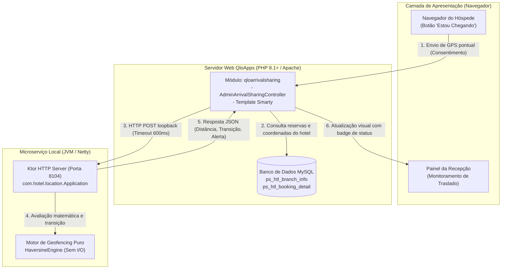
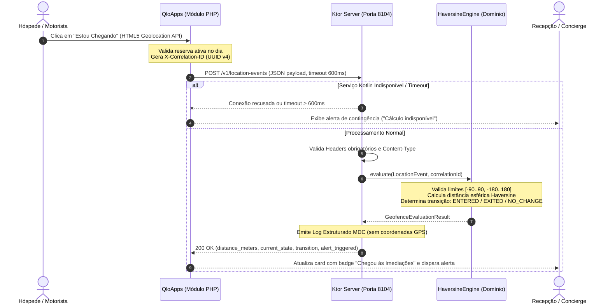

# Location Service (Kotlin) & QloArrivalSharing (PHP) — RFC-004

Documentação técnica unificada da funcionalidade de **Geofencing e Detecção de Chegada para Traslado (RFC-004 / QLO-FEAT-004)**. Este documento detalha a arquitetura de ponta a ponta, os princípios de design de software (SOLID e Clean Architecture), as decisões de engenharia (ADRs), as regras de negócio geodésicas, os contratos de API resilientes e o guia de operação.

---

## 1. Visão Geral & Arquitetura do Sistema

### 1.1. Contexto do Problema Operacional
Em operações hoteleiras com serviço de traslado ou atendimento a hóspedes VIP, a comunicação sobre a chegada de vans e veículos historicamente dependia de canais manuais (WhatsApp, chamadas de voz). Isso gerava gargalos operacionais: atraso na recepção, mensageiros despreparados e veículos retidos na entrada principal do hotel.

A solução da **RFC-004** introduz uma arquitetura híbrida de baixo acoplamento:
1. **Módulo QloApps (`qloarrivalsharing` em PHP):** Interface administrativa para a equipe de recepção e interface mobile/web para o hóspede enviar sua localização pontual sob consentimento explícito.
2. **Microserviço de Localização (`location-service-kotlin` em Kotlin/Ktor):** Serviço local determinístico de alta performance rodando em loopback (`127.0.0.1:8104`), responsável exclusivo pelo cálculo geodésico esférico (Haversine), validação de limites físicos de coordenadas e máquina de estados de geofence.

### 1.2. Stack Tecnológica & Versões Homologadas

| Componente | Tecnologia | Versão | Papel na Arquitetura |
| :--- | :--- | :--- | :--- |
| **Linguagem Backend** | Kotlin | **1.9.24** | Motor de geofencing, validações de domínio e tipagem estrita |
| **Runtime da JVM** | Java (JDK) | **JDK 17+** (testado com OpenJDK 17 e 21) | Plataforma de execução do microserviço |
| **Framework Web** | Ktor Server | **2.3.12** (Engine Netty) | Servidor HTTP assíncrono e negociação de conteúdo |
| **Serialização** | Kotlinx Serialization | **1.6.3** | Processamento JSON determinístico e tipado |
| **Logging Estruturado**| Logback + Logstash | **1.4.14** / **7.4** | Logs estruturados em JSON e contexto MDC |
| **Framework de Testes**| JUnit 5 / Kotlin Test | **5.10.2** / **1.9.24** | Testes unitários, de integração e validação de SLA |
| **Módulo Web / Admin** | PHP / Smarty | **PHP 8.1+** / **Smarty 3.x** | Interface com recepcionista e cliente HTTP cURL |

### 1.3. Diagrama de Arquitetura de Containers (Modelo C4)



---

## 2. Topologia e Fluxo de Requisições Ponta a Ponta

O fluxo síncrono garante que dados brutos de GPS permaneçam efêmeros na memória volátil, sem persistência em disco ou exposição em redes externas.



---

## 3. Design de Software, Clean Code & SOLID

O microserviço Kotlin segue os princípios da **Clean Architecture**, isolando completamente as regras matemáticas e o domínio das camadas de transporte HTTP e frameworks.

```text
com.hotel.location/
├── Application.kt            # Infraestrutura HTTP / Ktor Server / Routing / StatusPages
├── dto/
│   └── LocationEventDtos.kt  # DTOs de Transporte e Serialização JSON
├── exception/
│   ├── DomainExceptions.kt   # Exceções de Domínio de Negócio
│   └── LocationExceptions.kt # Exceções de Validação HTTP / Infraestrutura
├── model/
│   ├── GeoEnums.kt           # Enums de Estado (GeofenceState, GeofenceTransition)
│   └── GeoModels.kt          # Modelos de Domínio Imutáveis (Coordinates, LocationEvent)
└── service/
    └── HaversineEngine.kt    # Core de Domínio Puro (Matemática esférica e Geofencing)
```

### 3.1. Aplicação Prática dos Princípios SOLID

* **Single Responsibility Principle (SRP):**
  * `HaversineEngine`: Objeto de domínio puro dedicado exclusivamente ao cálculo trigonométrico da distância e resolução de transições de geofence. Não possui dependência de Ktor, Netty, HTTP ou banco de dados.
  * `Application.kt`: Atua estritamente como adaptador de infraestrutura (Content Negotiation, roteamento, validação de cabeçalhos e tradução de erros).
* **Open/Closed Principle (OCP):**
  * O pipeline de tratamento de erros no plugin `StatusPages` do Ktor é aberto para extensão e fechado para modificação. Novos erros de domínio derivados de `DomainException` são automaticamente formatados no padrão RFC 7807 sem necessidade de refatorar as rotas existentes.
* **Liskov Substitution Principle (LSP):**
  * Todas as subclasses de erro (`InvalidCoordinatesException`, `InvalidGeofenceRadiusException`, `MissingFieldException`) herdam de `DomainException`, garantindo que campos semânticos (`field`, `errorCode`) sejam preservados e tratados de forma intercambiável pelo handler central.
* **Interface Segregation Principle (ISP):**
  * Separação estrita entre o contrato externo da API (`LocationEventRequestDto`, `LocationEventResponseDto`) e as entidades de domínio (`Coordinates`, `LocationEvent`). Mudanças no schema JSON não corrompem os invariantes de domínio.
* **Dependency Inversion Principle (DIP):**
  * A regra de negócio central (`HaversineEngine`) reside no núcleo da arquitetura e não importa nenhuma classe do framework Ktor (`io.ktor.*`). Os módulos de alto nível (rotas HTTP) dependem das abstrações de domínio, nunca o inverso.

---

## 4. Regras de Negócio & Invariantes de Domínio

### 4.1. Formulação Geodésica de Haversine
Para obter distâncias na superfície esférica da Terra sem dependências pesadas de GIS:

$$\Delta\text{lat} = \text{lat}_2 - \text{lat}_1, \quad \Delta\text{lon} = \text{lon}_2 - \text{lon}_1$$

$$a = \sin^2\left(\frac{\Delta\text{lat}}{2}\right) + \cos(\text{lat}_1) \cdot \cos(\text{lat}_2) \cdot \sin^2\left(\frac{\Delta\text{lon}}{2}\right)$$

$$c = 2 \cdot \text{atan2}\left(\sqrt{a}, \sqrt{1 - a}\right)$$

$$d = R \cdot c \quad \text{onde } R = 6.371.000\text{ metros}$$

*A implementação utiliza `a.coerceIn(0.0, 1.0)` para evitar valores `NaN` provocados por imprecisão de ponto flutuante em pontos antipodais.*

### 4.2. Máquina de Estados e Resolução de Transições

O cálculo de geofencing opera como uma máquina de estados determinística baseada na comparação entre o estado anterior informado (`previous_state`) e a distância atual calculada em relação ao raio configurado ($distance \le radius$):

* **Estados Possíveis:**
  * **`OUTSIDE` (Fora):** O hóspede está além do raio do hotel ($distance > radius$).
  * **`INSIDE` (Dentro):** O hóspede está dentro ou exatamente na borda do raio ($distance \le radius$).

#### Tabela de Transições e Regra de Disparo de Alerta:

| Estado Anterior (`previous_state`) | Posição Atual Calculada | Estado Atual (`current_state`) | Transição Detectada | Alerta Disparado? (`alert_triggered`) | Comportamento Operacional na Recepção |
| :---: | :---: | :---: | :---: | :---: | :--- |
| **`outside`** | $\le \text{raio}$ (Dentro) | **`inside`** | **`ENTERED`** | **`true` (SIM)** | **Hóspede acabou de entrar no raio.** Dispara notificação visual e sonora na recepção. |
| **`inside`** | $> \text{raio}$ (Fora) | **`outside`** | **`EXITED`** | **`false` (NÃO)** | Hóspede se afastou ou o veículo ultrapassou o hotel. |
| **`outside`** | $> \text{raio}$ (Fora) | **`outside`** | **`NO_CHANGE`** | **`false` (NÃO)** | Hóspede continua em trânsito distante; nenhuma ação necessária. |
| **`inside`** | $\le \text{raio}$ (Dentro) | **`inside`** | **`NO_CHANGE`** | **`false` (NÃO)** | Hóspede permanece nas imediações/estacionamento. **Evita re-alertas ruidosos**. |

> **Regra de Ouro do Alerta:** O alerta operacional (`alert_triggered = true`) ocorre **única e exclusivamente** na transição `ENTERED` (quando o hóspede cruza a fronteira de fora para dentro do perímetro). Em qualquer outro cenário, `alert_triggered` é estritamente `false`.

### 4.3. Matriz de Decisão e Casos de Borda

| Cenário | Entrada (`previous_state`, Distância vs Raio) | `current_state` | `transition` | `alert_triggered` | Tratamento Técnico / Caso de Borda |
| :--- | :--- | :--- | :--- | :--- | :--- |
| **Entrada no Raio** | `outside`, $distance \le radius$ | `inside` | `ENTERED` | `true` | Hóspede cruza o perímetro; dispara aviso sonoro/visual na recepção. |
| **Saída do Raio** | `inside`, $distance > radius$ | `outside` | `EXITED` | `false` | Veículo ultrapassou o hotel ou mudou de trajeto. |
| **Permanência Fora** | `outside`, $distance > radius$ | `outside` | `NO_CHANGE` | `false` | Hóspede a caminho, sem ação necessária pela recepção. |
| **Permanência Dentro** | `inside`, $distance \le radius$ | `inside` | `NO_CHANGE` | `false` | Posição refinada dentro do pátio; evita múltiplos alertas ruidosos. |
| **Ponto Exato** | $distance = 0.0\text{ m}$ | `inside` | `ENTERED` / `NO_CHANGE` | Conforme estado | Coordenadas do hóspede e hotel coincidem perfeitamente. |
| **Borda do Raio** | $distance = radius$ (arredondado) | `inside` | Conforme estado | Conforme estado | Critério de inclusão fechado ($\le$). |
| **Coordenada Inválida** | $\text{lat} \notin [-90..90] \lor \text{lon} \notin [-180..180]$ | — | — | — | Rejeição imediata com `400 Bad Request` e RFC 7807. |
| **Raio Inválido** | $radius \le 0.0\text{ m}$ | — | — | — | Rejeição com `400 Bad Request` (`INVALID_RADIUS`). |

---

## 5. Contrato de API & Resiliência

O serviço escuta estritamente no endereço de loopback `http://127.0.0.1:8104`.

### 5.1. Endpoints

#### `GET /healthz`
Health check para monitoramento de liveness e readiness.
* **Sucesso (200 OK):**
  ```json
  {
    "status": "UP",
    "service": "location-service-kotlin",
    "port": 8104
  }
  ```
* **Degradação (503 Service Unavailable):** Retorna `status: "DOWN"` caso a flag de disponibilidade do serviço seja alterada para manutenção.

---

#### `POST /v1/location-events`
Avaliação determinística de geofence e cálculo de proximidade.

* **Headers Obrigatórios:**
  * `Content-Type: application/json`
  * `X-Correlation-ID: <uuid-v4>` *(Validação estrita de formato UUID v4)*

* **Request Payload (JSON):**
  ```json
  {
    "hotel_id": "htl-recife-01",
    "hotel_lat": -8.052240,
    "hotel_lng": -34.885650,
    "guest_lat": -8.053100,
    "guest_lng": -34.886100,
    "geofence_radius_m": 200.0,
    "previous_state": "outside"
  }
  ```

* **Response Payload — Sucesso (200 OK):**
  ```json
  {
    "correlation_id": "a1b2c3d4-e5f6-4a8b-8c0d-1e2f3a4b5c6d",
    "hotel_id": "htl-recife-01",
    "distance_meters": 107.7,
    "current_state": "inside",
    "transition": "ENTERED",
    "alert_triggered": true,
    "message": "Hóspede entrou no raio de 200m da propriedade."
  }
  ```

### 5.2. Tratamento Estruturado de Erros (RFC 7807 Problem Details)
Todas as falhas retornam `Content-Type: application/problem+json; charset=UTF-8`:

```json
{
  "type": "urn:problem-type:invalid-coordinates",
  "title": "Invalid Coordinates",
  "status": 400,
  "detail": "A latitude '95.0' deve estar entre -90.0 e 90.0 graus.",
  "instance": "/v1/location-events",
  "code": "INVALID_COORDINATES"
}
```

### 5.3. Resiliência e Degradação Graciosa
* **Cliente PHP (cURL):** Configurado com `CURLOPT_TIMEOUT_MS = 600`. Se o serviço Kotlin não responder em 600ms, o PHP encerra a conexão para evitar travamento do pool de threads do Apache.
* **Degradação no Painel:** O painel administrativo do QloApps detecta o código HTTP ou falha de conexão e renderiza um alerta informativo amigável, permitindo que as outras funções do hotel continuem operando normalmente.

---

## 6. Observabilidade, Performance & Privacidade (LGPD)

### 6.1. Acordo de Nível de Serviço (SLA / SLO)
* **Latência P95 (Motor Kotlin):** $< 10.0\text{ ms}$ para cálculo de Haversine e resolução de transição em memória.
* **Latência Ponta a Ponta (PHP + cURL + Kotlin):** $< 60.0\text{ ms}$.
* **Timeout do Cliente:** $600\text{ ms}$.

### 6.2. Estratégia de Logs Estruturados (SLF4J + Logback + MDC)
Cada evento gera uma entrada em stdout formatada em JSON com chaves padronizadas:

```json
{
  "timestamp": "2026-09-16T18:00:12.441Z",
  "level": "INFO",
  "correlation_id": "a1b2c3d4-e5f6-4a8b-8c0d-1e2f3a4b5c6d",
  "event": "GEOFENCE_EVALUATED",
  "hotel_id": "htl-recife-01",
  "distance_meters": 107.7,
  "transition": "ENTERED",
  "duration_ms": 1.12
}
```

### 6.3. Privacidade por Design (Privacy-by-Design & LGPD)
* **Não Persistência de GPS:** Por diretriz de segurança, coordenadas brutas (`guest_lat`, `guest_lng`, `hotel_lat`, `hotel_lng`) **nunca** são inseridas no contexto de log (MDC) nem persistidas em disco.
* **Coleta Pontual e Consentida:** Não há rastreamento em segundo plano (*background tracking*). A leitura de coordenadas ocorre exclusivamente no momento em que o hóspede clica conscientemente no botão "Estou Chegando".

---

## 7. Guia do Desenvolvedor & Runbook Operacional (DevEx)

### 7.1. Pré-requisitos de Ambiente
* **Java (JVM):** JDK 17 ou superior instalado (`java -version` $\ge$ 17). Compatível com Java 17 LTS e 21 LTS.
* **Kotlin:** Versão 1.9.24 (embutida e resolvida automaticamente via Gradle Wrapper).
* **PHP:** Versão 8.1 ou superior com extensão `curl` habilitada (para execução do módulo QloApps).
* **Acesso ao Terminal:** Para execução dos comandos Gradle e chamadas cURL.

### 7.2. Execução do Serviço Local
No diretório `location-service-kotlin/`:

```bash
# Iniciar o microserviço na porta 8104:
./gradlew run
```

### 7.3. Execução da Suíte de Testes
O projeto conta com testes unitários, testes de integração de API e baterias de verificação do SLA de latência:

```bash
# Executar todos os testes automatizados com JUnit 5:
./gradlew test

# Visualizar relatório de testes HTML gerado:
# build/reports/tests/test/index.html
```

### 7.4. Quickstart de Validação Rápida via cURL

```bash
# 1. Checar saúde do serviço:
curl -i http://127.0.0.1:8104/healthz

# 2. Simular entrada de hóspede no raio de 200m:
curl -i -X POST http://127.0.0.1:8104/v1/location-events \
  -H "Content-Type: application/json" \
  -H "X-Correlation-ID: 11111111-2222-4333-8444-555555555555" \
  -d '{
    "hotel_id": "htl-recife-01",
    "hotel_lat": -8.052240,
    "hotel_lng": -34.885650,
    "guest_lat": -8.053100,
    "guest_lng": -34.886100,
    "geofence_radius_m": 200.0,
    "previous_state": "outside"
  }'
```

---

## 8. Decisões de Arquitetura (ADRs), Trade-offs & Limitações Conhecidas

### 8.1. Registro de Decisões de Arquitetura (ADRs)

#### ADR-01: Adoção do Ktor Server com Netty em detrimento de Spring Boot
* **Contexto:** O microserviço é um motor utilitário local de alta frequência e baixa latência dedicado a cálculos matemáticos.
* **Decisão:** Utilizar Ktor Server em conjunto com Netty e Kotlinx Serialization.
* **Trade-off Positivo:** Inicialização quase instantânea (< 1s), consumo ínfimo de memória RAM (< 80MB) e ausência de overhead reflexivo.
* **Trade-off Negativo:** Menor ecossistema de bibliotecas opinativas prontas em comparação com o ecossistema Spring.

#### ADR-02: Motor Geodésico em Memória (Haversine) vs Provedores Externos de Mapas
* **Contexto:** Necessidade de verificar se um ponto está dentro do raio do hotel.
* **Decisão:** Implementar a fórmula de Haversine nativa em Kotlin.
* **Trade-off Positivo:** Zero latência de rede externa, zero dependência de chaves de API pagas (Google Maps, Mapbox) e execução 100% autônoma offline.
* **Trade-off Negativo:** Haversine calcula a distância euclidiana/esférica em linha reta (distância de voo de pássaro), sem considerar o traçado das vias urbanas ou o tráfego em tempo real.

#### ADR-03: Comunicação HTTP Loopback Síncrona vs Mensageria Assíncrona
* **Contexto:** Integração entre o monolito PHP QloApps e o microserviço Kotlin.
* **Decisão:** HTTP síncrono local (`127.0.0.1`) com timeout curto (600ms).
* **Trade-off Positivo:** Simplicidade operacional máxima; não exige setup ou manutenção de brokers intermediários (Kafka/RabbitMQ).
* **Trade-off Negativo:** Acoplamento temporal no instante da chamada, mitigado pelo circuito de timeout e degradação graciosa no PHP.

---

### 8.2. Limitações Conhecidas
1. **Topologia Urbana:** Como a distância é em linha reta, em cidades com barreiras geográficas (rios, pontes distantes) a distância calculada pode ser significativamente menor que a distância de condução real do veículo.
2. **Ciclo de Vida do Processo:** O serviço Kotlin é executado como daemon autônomo. Em ambientes de produção sem containerização (Docker/Kubernetes), requer supervisão via systemd ou PM2 para autorestart.

---

### 8.3. Roadmap Técnico & Evolução Futura (Versão 2)
* [ ] **Push em Tempo Real:** Implementar Server-Sent Events (SSE) ou WebSockets entre o Ktor e o painel da recepção para eliminar a necessidade de polling manual.
* [ ] **Múltiplos Perímetros Escalonados:** Suporte a raios concêntricos (ex.: 2km "A Caminho", 500m "Próximo", 100m "No Portão").
* [ ] **Persistência Distribuída de Estado:** Adoção de Redis Geo caso o serviço precise escalar horizontalmente além de uma única instância local.
